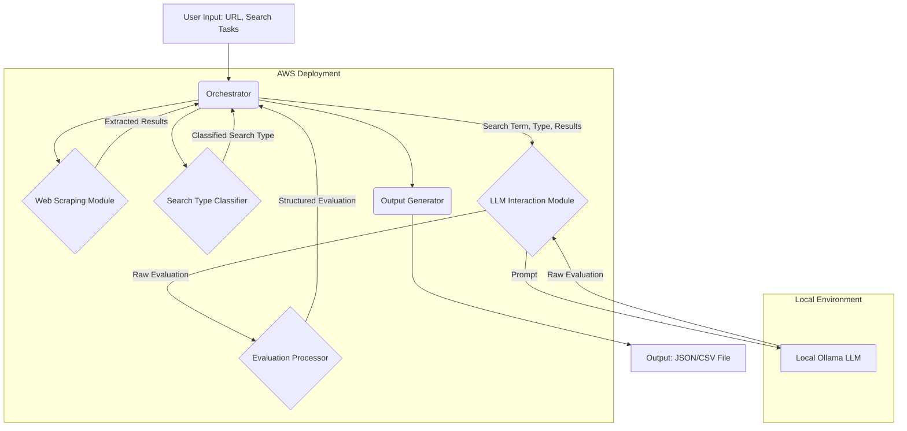

# Agentic E-commerce Search Solution: System Architecture

This document details the architecture for the agentic solution designed to search tundrafmp.com, extract results, and evaluate their relevance using a local LLM via Ollama, deployable on AWS.

## 1. High-Level Architecture

The system follows a modular, service-oriented approach. An orchestrator manages the workflow, invoking specialized components for web scraping, search type classification, LLM interaction, and result processing.


*(Note: Mermaid diagram for visualization)*

**Workflow:**
1.  The **Orchestrator** receives the target URL and a list of search tasks.
2.  For each task, it invokes the **Web Scraping Module** to perform the search on the target site and extract product results.
3.  The **Search Type Classifier** (optional, can be integrated into the Orchestrator or LLM module) determines the nature of the search query (word, part number, multi-term).
4.  The **Orchestrator** passes the query, type, and scraped results to the **LLM Interaction Module**.
5.  This module constructs a specific prompt based on the search type and sends it along with the results data to the **Local Ollama LLM**.
6.  The LLM returns a raw text evaluation.
7.  The **Evaluation Processor** parses the LLM's response to extract structured relevance information (e.g., High/Medium/Low, justification).
8.  The **Orchestrator** collects the processed evaluation.
9.  Once all tasks are processed, the **Output Generator** formats the complete results into the final output file (JSON/CSV).

## 2. Component Design

*   **Orchestrator (Python/Java):**
    *   The central control unit.
    *   Manages the overall process flow.
    *   Handles task queuing and distribution (if parallel processing is desired).
    *   Coordinates interactions between other modules.
    *   Manages state and aggregates results.
    *   Could be implemented as a main application script or class.

*   **Web Scraping Module (Python with Selenium/Playwright or Java with Selenium):**
    *   Responsible for interacting with `tundrafmp.com`.
    *   Uses a headless browser controlled by Selenium or Playwright.
    *   Navigates to the site, locates the search bar, inputs the query, and submits.
    *   Parses the search results page HTML.
    *   Extracts key data points for each result (title, part number, description snippet, URL, price if available).
    *   Handles potential challenges: dynamic content loading (waits), pagination (loops), anti-scraping measures (user-agent rotation, delays, potentially CAPTCHA handling - though this is complex).
    *   Includes robust error handling (timeouts, element not found exceptions).

*   **Search Type Classifier (Python/Java):**
    *   Analyzes the input `query` string.
    *   Uses regular expressions to detect patterns typical of part numbers (e.g., alphanumeric sequences, specific lengths, presence of hyphens).
    *   Uses heuristics like word count and presence of common English words vs. alphanumeric codes.
    *   If a query doesn't match part number patterns and contains multiple words, classify as "multiple_terms".
    *   Otherwise, classify as "english_word".
    *   This logic can be simple initially and refined as needed.

*   **LLM Interaction Module (Python/Java):**
    *   Constructs prompts tailored to the `search_type` (details in the next section).
    *   Formats the scraped results data clearly within the prompt.
    *   Uses standard HTTP client libraries to send POST requests to the Ollama API endpoint (e.g., `http://localhost:11434/api/generate`).
    *   Specifies the desired Ollama model (`model` parameter in the API request).
    *   Receives the JSON response from Ollama, extracting the generated text.
    *   Handles API errors (connection issues, timeouts, Ollama errors).

*   **Evaluation Processor (Python/Java):**
    *   Takes the raw text output from the LLM.
    *   Uses string parsing or regular expressions to identify the relevance assessment (e.g., keywords like "High Relevance", "Partial Match", "Low Relevance") and the justification text for each evaluated result.
    *   Standardizes the output into predefined categories (e.g., "High", "Medium", "Low").
    *   Handles cases where the LLM output might not be perfectly structured.

*   **Output Generator (Python/Java):**
    *   Receives the aggregated data (original query, type, scraped results, structured evaluations) from the Orchestrator.
    *   Formats this data into a structured JSON or CSV file as specified in the requirements.

## 3. Data Flow

Data flows sequentially through the components as described in the workflow. Key data structures include:
*   Input Task List (JSON/Dictionary)
*   Scraped Results List (List of Dictionaries/Objects)
*   LLM Prompt (String)
*   LLM Raw Response (String)
*   Structured Evaluation (Dictionary/Object)
*   Final Output (JSON/CSV file)

## 4. AWS Deployment Architecture

A container-based approach using Docker is recommended for portability and consistency.

*   **Compute:**
    *   **Option 1 (EC2):** Deploy the entire application (Orchestrator and all modules) within a Docker container running on an EC2 instance. The Ollama LLM would also run in a separate container (or directly on the host) on the *same* EC2 instance to ensure local access.
    *   **Option 2 (ECS/Fargate):** Package the application (excluding Ollama) as a Docker container and run it using AWS Fargate (serverless containers) or ECS on EC2. Ollama would still need to run on a dedicated EC2 instance accessible by the Fargate/ECS task over the network (within the VPC).
    *   **Option 3 (Lambda - More Complex):** Break down components into Lambda functions triggered by an event source (e.g., SQS queue for tasks). Web scraping with headless browsers in Lambda can be challenging due to package size and execution limits. Ollama cannot run directly in Lambda; it would require a separate EC2 instance or potentially SageMaker endpoint (if using a managed model, deviating from the local Ollama requirement).
    *   **Recommendation:** Start with **Option 1 (EC2)** for simplicity, as it keeps the application and the required local Ollama instance together.

*   **Ollama Instance:** A dedicated EC2 instance (CPU or GPU, depending on the chosen LLM and performance needs) to run the Ollama server and the selected model.

*   **Networking:**
    *   A Virtual Private Cloud (VPC) to host the resources.
    *   Security Groups to control traffic: Allow inbound traffic for SSH (management) and potentially HTTP/HTTPS if an API interface is added. Allow outbound traffic for web scraping. Ensure the application container/instance can reach the Ollama instance's API port (default 11434).

*   **Storage:**
    *   S3 for storing input task files and output result files.
    *   EBS volumes attached to EC2 instances for the operating system, application code, Docker images, and Ollama models.

*   **Infrastructure as Code (IaC):**
    *   Use AWS CDK (TypeScript/Python/Java), Terraform, or CloudFormation to define and provision the VPC, EC2 instances, Security Groups, IAM roles, and potentially S3 buckets.

*   **Containerization:**
    *   Dockerfile to define the application environment (Java/Python runtime, dependencies, web driver).
    *   Dockerfile (or use official Ollama image) for the Ollama server.

**Simplified EC2 Deployment Diagram:**

```
+----------------------------------------------------+
| AWS Cloud                                          |
| +------------------------------------------------+ |
| | VPC                                            | |
| | +--------------------+  +--------------------+ | |
| | | EC2 Instance (App) |  | EC2 Instance (Ollama)| | |
| | | +----------------+ |  | +----------------+ | | |
| | | | Docker         | |  | | Docker         | | | |
| | | | +------------+ | |  | | +------------+ | | | |
| | | | | App        | |<----->| | Ollama     | | | | |
| | | | | Container  | | |  | | | Container  | | | | |
| | | | +------------+ | |  | | +------------+ | | | |
| | | +----------------+ |  | +----------------+ | | |
| | +--------------------+  +--------------------+ | |
| |        |                                       | |
| |        v                                       | |
| | +--------------------+                         | |
| | | S3 Bucket          |                         | |
| | | (Input/Output)     |                         | |
| | +--------------------+                         | |
| +------------------------------------------------+ |
+----------------------------------------------------+
       ^
       |
+------|-----------------+
| User (Uploads Input,   |
|       Downloads Output)|
+------------------------+
```

