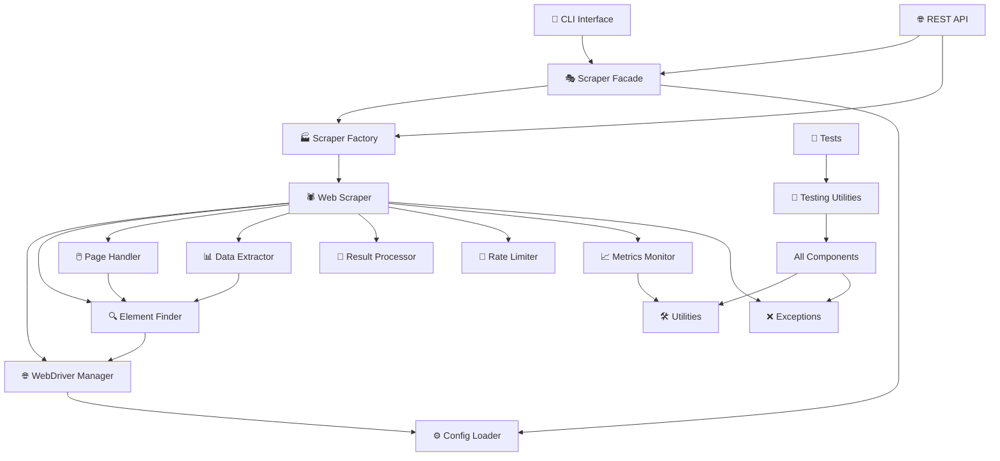

# Enterprise Web Scraper - Project Structure

## Directory Structure

```
enterprise-web-scraper/
├── 📁 src/                                 # Main source code
│   ├── 🔧 config_models.py                # Configuration data classes
│   ├── ⚙️  config_loader.py               # Configuration loading & parsing
│   ├── 🌐 web_driver_manager.py          # WebDriver lifecycle management
│   ├── 🔍 element_finder.py              # Element location strategies
│   ├── 🖱️  page_interaction_handler.py   # Page interactions & utilities
│   ├── 📊 data_extractor.py              # Data extraction from elements
│   ├── 🕷️  web_scraper.py                # Main scraping orchestration
│   ├── 🎭 scraper_facade.py              # High-level API & compatibility
│   ├── 🏭 scraper_factory.py             # Factory for scraper types
│   ├── ❌ exceptions.py                   # Custom exception hierarchy
│   ├── 📈 metrics_monitor.py             # Performance monitoring
│   ├── 🔄 result_processor.py            # Result processing pipeline
│   ├── 🚦 rate_limiter.py                # Rate limiting utilities
│   ├── 🛠️  utilities.py                  # Shared utilities
│   ├── 🧪 testing_utilities.py           # Testing framework
│   ├── 💻 cli_interface.py               # Command-line interface
│   ├── 🌐 api_server.py                  # REST API server
│   ├── 📋 example_usage.py               # Usage examples
│   ├── 🏢 integration_example.py         # Enterprise integration
│   └── ⚡ performance_benchmarks.py      # Performance benchmarking
│
├── 📁 config/                             # Configuration files
│   ├── config_examples.json              # Example configurations
│   ├── production.json                   # Production config
│   └── development.json                  # Development config
│
├── 📁 tests/                              # Test suite
│   ├── test_web_driver_manager.py
│   ├── test_element_finder.py
│   ├── test_data_extractor.py
│   ├── test_web_scraper.py
│   ├── test_result_processor.py
│   ├── test_rate_limiter.py
│   ├── test_integration.py
│   └── conftest.py                       # Pytest configuration
│
├── 📁 data/                               # Data persistence
│   ├── results/                          # Scraping results
│   ├── metrics/                          # Metrics data
│   └── reports/                          # Generated reports
│
├── 📁 logs/                               # Application logs
│   ├── scraper.log
│   ├── api.log
│   └── performance.log
│
├── 📁 docker/                             # Container configuration
│   ├── Dockerfile                        # Production container
│   ├── Dockerfile.dev                    # Development container
│   ├── docker-compose.yml               # Multi-service deployment
│   └── docker-compose.dev.yml           # Development override
│
├── 📁 scripts/                            # Utility scripts
│   ├── setup_environment.sh             # Environment setup
│   ├── run_benchmarks.sh                # Performance testing
│   ├── backup_data.sh                   # Data backup
│   └── health_check.sh                  # Health monitoring
│
├── 📁 docs/                               # Documentation
│   ├── README.md                         # Main documentation
│   ├── MIGRATION_GUIDE.md               # Migration instructions
│   ├── DEPLOYMENT_GUIDE.md              # Deployment guide
│   ├── API_DOCUMENTATION.md             # API reference
│   └── ARCHITECTURE.md                  # Architecture details
│
├── 📁 monitoring/                         # Monitoring configuration
│   ├── prometheus.yml                    # Prometheus config
│   ├── grafana/                          # Grafana dashboards
│   └── alerts.yml                       # Alert rules
│
├── setup.py                              # Package installation
├── requirements.txt                      # Dependencies
├── .gitignore                           # Git ignore rules
├── .pre-commit-config.yaml             # Code quality hooks
└── pyproject.toml                       # Modern Python packaging
```

## Architecture Layers

```
┌─────────────────────────────────────────────────────────────┐
│                    🌐 INTERFACES LAYER                      │
├─────────────────────────────────────────────────────────────┤
│  📱 CLI Interface     🌐 REST API        📊 Monitoring      │
│  cli_interface.py    api_server.py       metrics_monitor.py │
└─────────────────────────────────────────────────────────────┘
                                │
┌─────────────────────────────────────────────────────────────┐
│                   🎭 FACADE & FACTORY LAYER                 │
├─────────────────────────────────────────────────────────────┤
│  🎭 Scraper Facade   🏭 Scraper Factory                     │
│  scraper_facade.py   scraper_factory.py                     │
└─────────────────────────────────────────────────────────────┘
                                │
┌─────────────────────────────────────────────────────────────┐
│                    🕷️ SCRAPING CORE LAYER                   │
├─────────────────────────────────────────────────────────────┤
│  🕷️ Web Scraper      📊 Data Extractor   🔄 Result Processor│
│  web_scraper.py     data_extractor.py    result_processor.py│
└─────────────────────────────────────────────────────────────┘
                                │
┌─────────────────────────────────────────────────────────────┐
│                   🔧 INFRASTRUCTURE LAYER                   │
├─────────────────────────────────────────────────────────────┤
│  🌐 Driver Manager   🔍 Element Finder   🖱️ Page Handler    │
│  web_driver_manager  element_finder.py   page_interaction.py│
└─────────────────────────────────────────────────────────────┘
                                │
┌─────────────────────────────────────────────────────────────┐
│                    🛠️ UTILITIES LAYER                       │
├─────────────────────────────────────────────────────────────┤
│  ⚙️ Config Loader    🚦 Rate Limiter     ❌ Exceptions      │
│  config_loader.py   rate_limiter.py      exceptions.py      │
│                                                             │
│  🛠️ Utilities        🧪 Testing Utils    📈 Performance     │
│  utilities.py       testing_utilities.py performance_bench  │
└─────────────────────────────────────────────────────────────┘
```

## Component Dependencies



## Data Flow Architecture

```
┌─────────────┐    ┌─────────────┐    ┌─────────────┐    ┌─────────────┐
│   📝 Input   │ -> │ 🔧 Config   │ -> │ 🏭 Factory   │ -> │ 🕷️ Scraper  │
│ Search Terms│    │   Loading   │    │  Creation   │    │ Execution   │
└─────────────┘    └─────────────┘    └─────────────┘    └─────────────┘
                                                                   │
┌─────────────┐    ┌─────────────┐    ┌─────────────┐    ┌─────────────┐
│ 📊 Output   │ <- │ 🔄 Result   │ <- │ 📊 Data     │ <- │ 🌐 Browser  │
│  Processed  │    │ Processing  │    │ Extraction  │    │ Interaction │
└─────────────┘    └─────────────┘    └─────────────┘    └─────────────┘
```

## Module Relationships

### **Core Dependencies**
- `web_scraper.py` → orchestrates everything
- `scraper_facade.py` → simplifies usage
- `scraper_factory.py` → creates appropriate scrapers

### **Infrastructure Dependencies**
- `web_driver_manager.py` → manages browser lifecycle
- `element_finder.py` → locates web elements
- `page_interaction_handler.py` → handles page interactions

### **Processing Dependencies**
- `data_extractor.py` → extracts structured data
- `result_processor.py` → processes and cleans results
- `rate_limiter.py` → ensures respectful scraping

### **Support Dependencies**
- `config_loader.py` → loads configurations
- `metrics_monitor.py` → tracks performance
- `exceptions.py` → handles errors gracefully
- `utilities.py` → provides common functions

### **Interface Dependencies**
- `cli_interface.py` → command-line access
- `api_server.py` → REST API access
- `testing_utilities.py` → testing framework

## Deployment Architecture

```
🏢 PRODUCTION ENVIRONMENT
├── 🐳 Docker Containers
│   ├── 🕷️ Scraper Service    (web_scraper + dependencies)
│   ├── 🌐 API Service        (api_server.py)
│   ├── 👷 Worker Service     (background tasks)
│   └── 📊 Monitoring Stack   (Prometheus + Grafana)
│
├── 📁 Persistent Storage
│   ├── 🗃️ Results Database   (PostgreSQL)
│   ├── ⚡ Cache Layer        (Redis)
│   └── 📂 File Storage       (volumes)
│
└── 🔗 Network Layer
    ├── 🌍 Load Balancer      (Nginx)
    ├── 🔒 SSL Termination
    └── 🚦 Rate Limiting
```

## Configuration Flow

```
📝 config_examples.json
     │
     ├── 🏭 production.json ──┐
     ├── 🧪 development.json ─┤
     └── 🧩 custom.json ──────┤
                              │
                              ▼
                      ⚙️ config_loader.py
                              │
                              ▼
                      🔧 config_models.py
                              │
                              ▼
                    📋 Validated Configuration
                              │
                              ▼
                      🏭 scraper_factory.py
                              │
                              ▼
                      🕷️ Configured Scraper
```

## Key Design Patterns Used

1. **🏭 Factory Pattern** - `scraper_factory.py` creates different scraper types
2. **🎭 Facade Pattern** - `scraper_facade.py` simplifies complex operations  
3. **🔧 Builder Pattern** - `result_processor.py` builds processing pipelines
4. **🔍 Strategy Pattern** - `element_finder.py` tries multiple selector strategies
5. **📊 Observer Pattern** - `metrics_monitor.py` observes scraping operations
6. **🚦 Rate Limiting Pattern** - `rate_limiter.py` implements various limiting strategies

## Import Hierarchy

```python
# Top Level (No internal dependencies)
config_models.py
exceptions.py
utilities.py

# Infrastructure Level  
config_loader.py        (depends on: config_models, utilities)
web_driver_manager.py   (depends on: config_models)
rate_limiter.py         (depends on: utilities)

# Core Level
element_finder.py              (depends on: web_driver_manager)
page_interaction_handler.py   (depends on: element_finder, utilities)  
data_extractor.py             (depends on: element_finder, config_models)
metrics_monitor.py            (depends on: utilities, exceptions)

# Orchestration Level
result_processor.py    (depends on: utilities, exceptions)
web_scraper.py        (depends on: all core + infrastructure)

# High Level APIs
scraper_factory.py    (depends on: web_scraper, config_loader)
scraper_facade.py     (depends on: scraper_factory, result_processor)

# Interfaces
cli_interface.py      (depends on: scraper_facade, all utilities)
api_server.py        (depends on: scraper_facade, metrics_monitor)

# Examples & Testing
testing_utilities.py     (depends on: most components)
example_usage.py        (depends on: scraper_facade, all features)
performance_benchmarks.py (depends on: scraper_factory, testing_utilities)
```

This modular architecture provides:
- ✅ **Clear separation of concerns**
- ✅ **Easy testing and mocking**
- ✅ **Flexible configuration management**
- ✅ **Scalable deployment options**
- ✅ **Comprehensive monitoring**
- ✅ **Multiple interface options**
- ✅ **Backward compatibility**